# TP 2 — API REST 

## Contexte du projet

Ce TP a pour objectif de construire une **API REST complète** avec Node.js et Express permettant de gérer une liste d'utilisateurs. Les données sont stockées **en mémoire** (tableau JavaScript), ce qui permet de se concentrer sur la logique REST sans base de données.

L'API expose les opérations **CRUD** (Create, Read, Update, Delete) sur la ressource `/api/users`, et respecte les conventions REST en termes de méthodes HTTP et de codes de réponse.

### Stack technique

| Outil          | Rôle                                              |
| -------------- | ------------------------------------------------- |
| **Node.js**    | Environnement d'exécution JavaScript côté serveur |
| **Express 5**  | Framework HTTP pour créer les routes REST         |
| **ES Modules** | Syntaxe `import/export` native                    |

### Lancer le serveur

```bash
node server.js
# Serveur disponible sur http://localhost:3001
```

---

## Structure du projet

```
backend/
├── data/
│   └── users.js          # Données en mémoire (3 utilisateurs initiaux)
├── routes/
│   └── users.js          # Routes CRUD pour /api/users
├── screenshots/          # Captures des tests via Bruno/Insomnia
├── server.js             # Point d'entrée de l'application
└── package.json
```

---

## Endpoints disponibles

| Méthode  | Route            | Description                     | Code succès |
| -------- | ---------------- | ------------------------------- | ----------- |
| `GET`    | `/api/users`     | Récupérer tous les utilisateurs | 200         |
| `GET`    | `/api/users/:id` | Récupérer un utilisateur par ID | 200         |
| `POST`   | `/api/users`     | Créer un nouvel utilisateur     | 201         |
| `PUT`    | `/api/users/:id` | Modifier un utilisateur         | 200         |
| `DELETE` | `/api/users/:id` | Supprimer un utilisateur        | 204         |

### Codes d'erreur

| Code                        | Signification                                       |
| --------------------------- | --------------------------------------------------- |
| `400 Bad Request`           | Données invalides (ex : `name` ou `email` manquant) |
| `404 Not Found`             | Ressource introuvable (ID inexistant)               |
| `500 Internal Server Error` | Bug côté serveur                                    |

---

## Tâche 3.1 — Scénario de test complet

Les tests suivants doivent être exécutés **dans l'ordre**. Chaque étape s'appuie sur la précédente.

---

### Étape 1 — `GET /api/users` · Vérifier les 3 utilisateurs initiaux

**Requête :**

```
GET http://localhost:3001/api/users
```

**Résultat attendu :** Code `200 OK`, tableau de 3 utilisateurs (Hugo Tigre, Tommy Bonnes Pratiques, Simon l'échequier).


---

### Étape 2 — `POST /api/users` · Créer un nouvel utilisateur

**Requête :**

```
POST http://localhost:3001/api/users
Content-Type: application/json

{
  "name": "No Role",
  "email": "j@cole.com",
  "role": "user"
}
```

**Résultat attendu :** Code `201 Created`, l'utilisateur créé est retourné avec son `id` (ici `4`). Notez cet `id` pour les étapes suivantes.


---

### Étape 3 — `GET /api/users/:id` · Récupérer l'utilisateur créé

**Requête :**

```
GET http://localhost:3001/api/users/4
```

**Résultat attendu :** Code `200 OK`, retourne l'utilisateur avec l'`id: 4`.


---

### Étape 4 — `PUT /api/users/:id` · Modifier le rôle de l'utilisateur

**Requête :**

```
PUT http://localhost:3001/api/users/4
Content-Type: application/json

{
  "role": "admin"
}
```

**Résultat attendu :** Code `200 OK`, l'utilisateur est retourné avec le rôle mis à jour.


---

### Étape 5 — `GET /api/users` · Vérifier que la liste contient 4 utilisateurs

**Requête :**

```
GET http://localhost:3001/api/users
```

**Résultat attendu :** Code `200 OK`, `"count": 4`.


---

### Étape 6 — `DELETE /api/users/:id` · Supprimer l'utilisateur créé

**Requête :**

```
DELETE http://localhost:3001/api/users/4
```

**Résultat attendu :** Code `204 No Content`, aucun corps de réponse.


---

### Étape 7 — `GET /api/users/:id` · Tenter de récupérer l'utilisateur supprimé

**Requête :**

```
GET http://localhost:3001/api/users/4
```

**Résultat attendu :** Code `404 Not Found`, message d'erreur `"Utilisateur non trouvé"`.


---

## Tâche 3.2 — Tests des cas d'erreur

Ces tests vérifient que l'API gère correctement les situations anormales.

---

### `POST` sans `name` ni `email` → doit retourner `400`

**Requête :**

```
POST http://localhost:3001/api/users
Content-Type: application/json

{
  "role": "admin"
}
```

**Résultat attendu :** Code `400 Bad Request`.


---

### `GET /api/users/9999` → doit retourner `404`

**Requête :**

```
GET http://localhost:3001/api/users/9999
```

**Résultat attendu :** Code `404 Not Found`, `{ "success": false, "message": "Utilisateur non trouvé" }`.


---

### `PUT /api/users/9999` → doit retourner `404`

**Requête :**

```
PUT http://localhost:3001/api/users/9999
Content-Type: application/json

{ "role": "admin" }
```

**Résultat attendu :** Code `404 Not Found`, `{ "success": false, "message": "Utilisateur non trouvé" }`.


---

### `DELETE /api/users/9999` → doit retourner `404`

**Requête :**

```
DELETE http://localhost:3001/api/users/9999
```

**Résultat attendu :** Code `404 Not Found`, `{ "success": false, "message": "Utilisateur non trouvé" }`.


---

## 4. Tests et Validation des API

Cette section détaille les tests fonctionnels réalisés pour valider les routes de l'API ainsi que la robustesse de la gestion des erreurs avec MongoDB.

---

### 4.1 — Scénario de test complet (Happy Path)
Ce scénario suit le cycle de vie standard d'une ressource utilisateur, de sa création à sa suppression.

| Étape | Méthode | Route | Résultat attendu | Capture d'écran |
| :--- | :---: | :--- | :--- | :--- |
| **1** | `GET` | `/api/users` | Liste initiale (3 users via seed) | 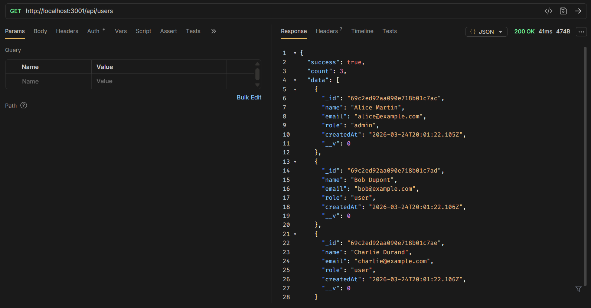 |
| **2** | `POST` | `/api/users` | Création réussie (Code 201 + `_id`) | 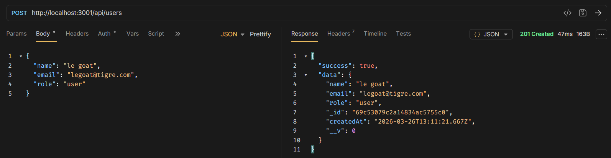 |
| **3** | `GET` | `/api/users/:id` | Récupération par ID (Nom conforme) | 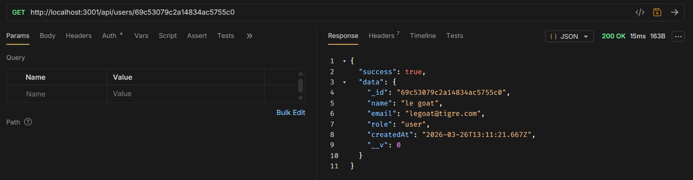 |
| **4** | `PUT` | `/api/users/:id` | Modification du champ (Code 200) | 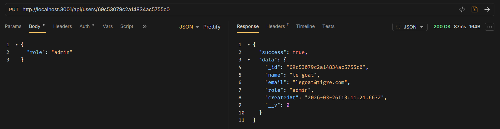 |
| **5** | `GET` | `/api/users` | Vérification du compte (count: 4) | 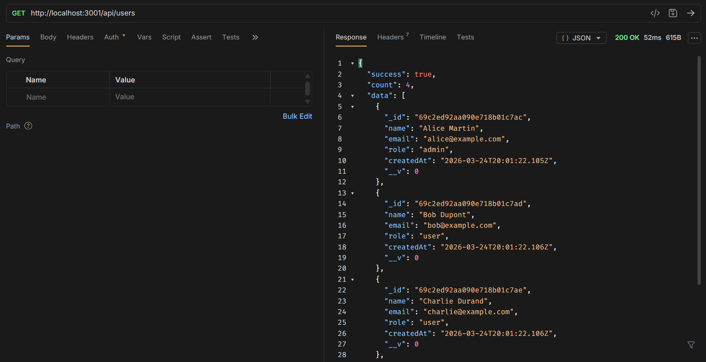 |
| **6** | `DELETE`| `/api/users/:id` | Suppression réussie (Code 204) | 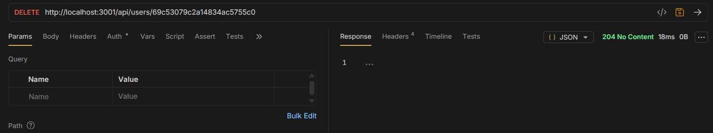 |
| **7** | `GET` | `/api/users/:id` | Vérification finale (Code 404) | 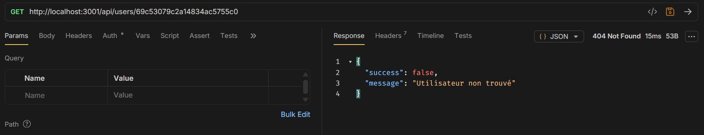 |

---

### 4.2 — Tests des cas d'erreur MongoDB
Validation des mécanismes de sécurité et de gestion d'erreurs du serveur.

#### ❌ Conflit d'email (Doublon)
* **Action :** `POST` avec un email déjà existant en base de données.
* **Attendu :** Code `409 Conflict`.
* 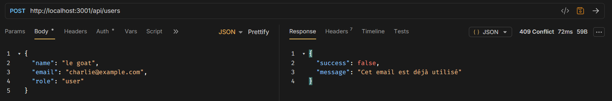

#### ❌ Format d'ID invalide
* **Action :** `GET` avec un ID malformé (ex: `123`).
* **Attendu :** Code `400 Bad Request` (ObjectId invalide).
* 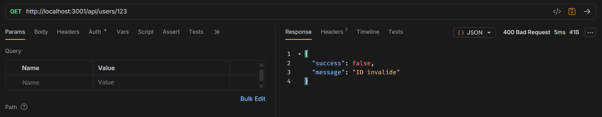

#### ❌ ID Introuvable
* **Action :** `GET` avec un ID au format valide mais inexistant (`000000000000000000000000`).
* **Attendu :** Code `404 Not Found`.
* 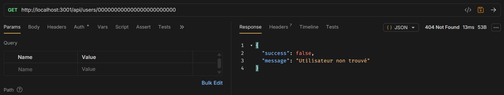

---

### 4.3 — Test de persistance ⭐
Ce test valide l'objectif principal : la sauvegarde réelle des données dans MongoDB.

1. **Étape 1 : Création de l'utilisateur**
   * Exécution d'un `POST` et récupération de l'_id généré.
   * 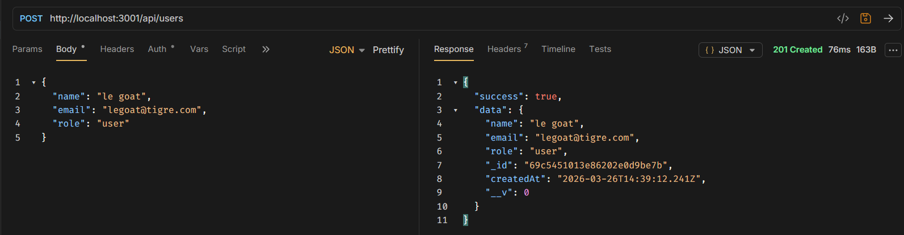

2. **Étape 2 : Redémarrage du serveur**
   * Arrêt manuel (`Ctrl+C`) et relance avec `node server.js`.
   * 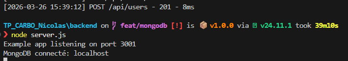

3. **Étape 3 : Vérification de la persistance**
   * Requête `GET /api/users/:id` avec l'ID précédemment créé.
   * **Résultat attendu :** L'utilisateur est toujours récupéré avec succès.
   * 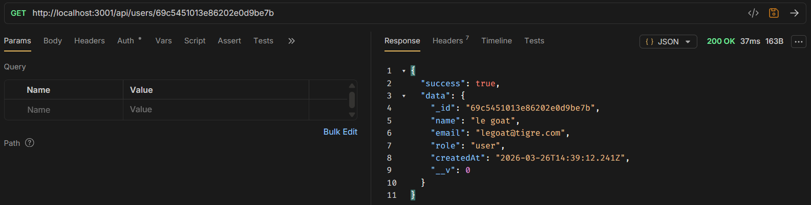

---

## 5. Tests et Validation du Frontend (React)

Cette section documente les tests fonctionnels de l'interface utilisateur et son intégration avec l'API Backend.

### 5.1 — Scénarios de test de l'interface
Chaque test valide une fonctionnalité clé du client React et sa communication avec le service Axios.

| Étape | Action | Résultat attendu | Capture d'écran |
| :--- | :--- | :--- | :--- |
| **1** | Lancer le frontend (`npm run dev`) | La liste des utilisateurs s'affiche (Données Séance 3) | 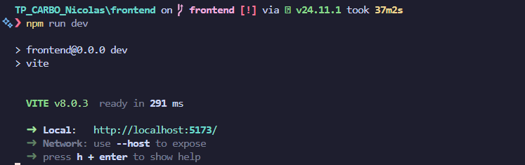 |
| **2** | Soumettre le formulaire valide | Nouvel utilisateur ajouté à la liste sans rechargement | 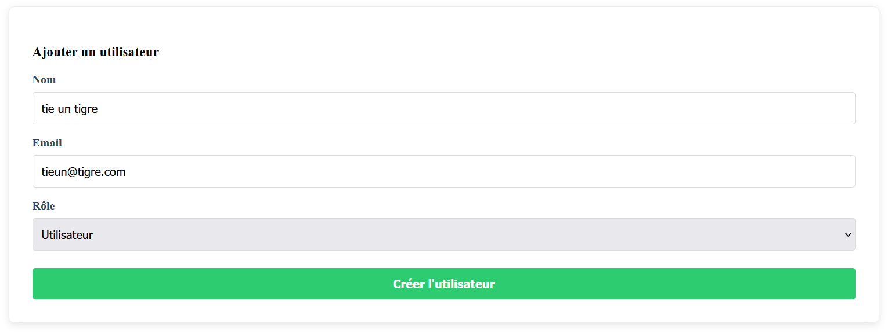 |
| **3** | Cliquer sur "Supprimer" | L'utilisateur disparaît de la liste immédiatement | 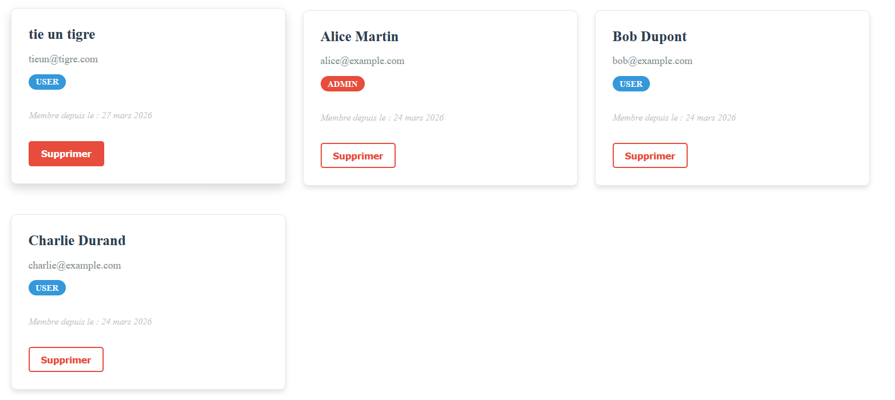 |
| **4** | Soumettre avec un champ vide | Message d'erreur affiché, aucun appel API effectué | 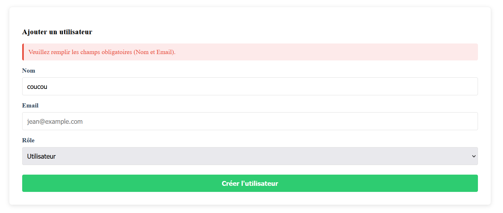 |
| **5** | Soumettre un email existant | Erreur 409 de l'API affichée dans l'interface | 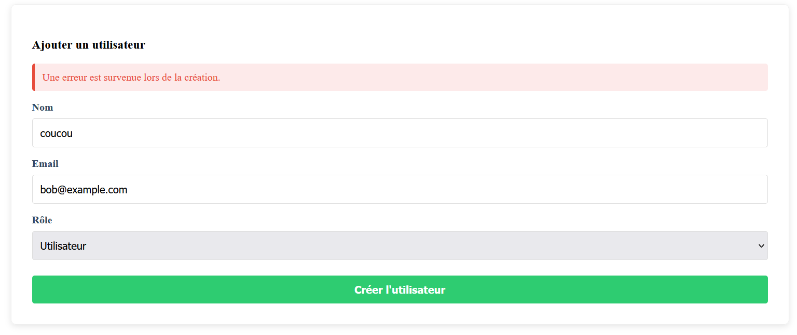 |
| **6** | Couper l'API Backend (`Ctrl+C`) | Message d'erreur de connexion affiché (pas de crash) | 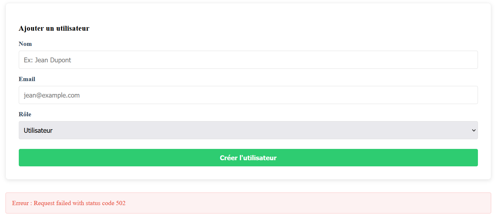 |
| **7** | Redémarrer l'API et recharger | Les données sont persistantes (MongoDB) | 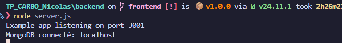 |

---