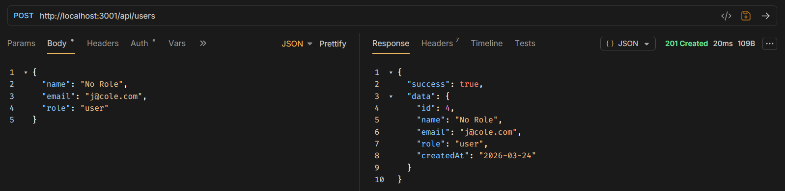
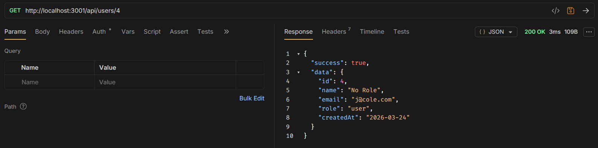
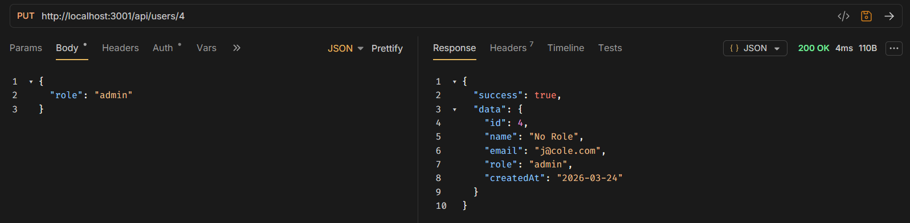
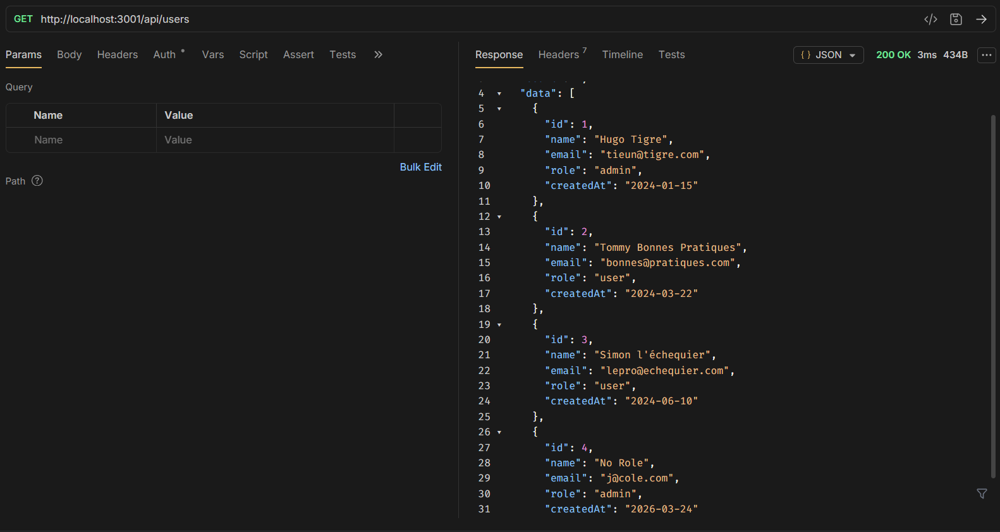
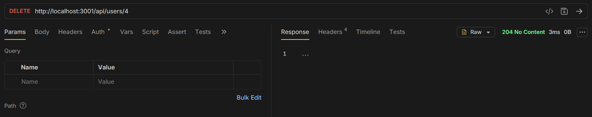
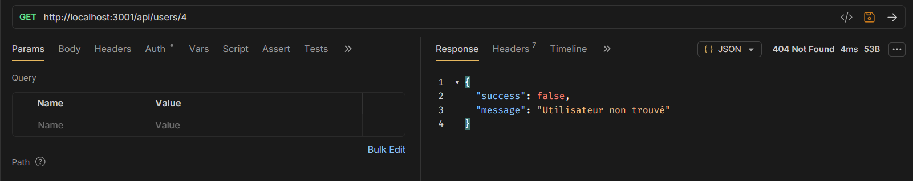
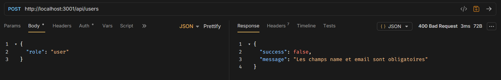
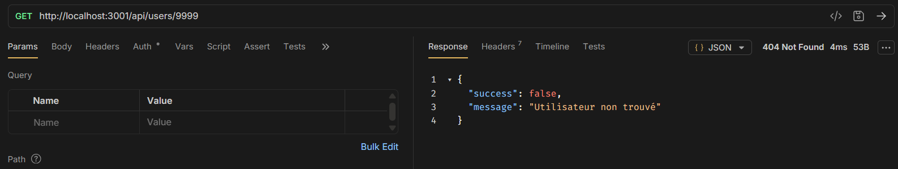
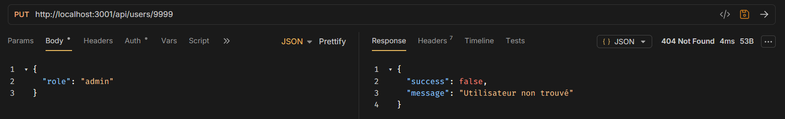
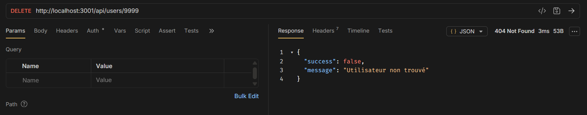

# TP 2 — API REST · Nicolas Carbo

## Contexte du projet

Ce TP a pour objectif de construire une **API REST complète** avec Node.js et Express permettant de gérer une liste d'utilisateurs. Les données sont stockées **en mémoire** (tableau JavaScript), ce qui permet de se concentrer sur la logique REST sans base de données.

L'API expose les opérations **CRUD** (Create, Read, Update, Delete) sur la ressource `/api/users`, et respecte les conventions REST en termes de méthodes HTTP et de codes de réponse.

### Stack technique

| Outil | Rôle |
|---|---|
| **Node.js** | Environnement d'exécution JavaScript côté serveur |
| **Express 5** | Framework HTTP pour créer les routes REST |
| **ES Modules** | Syntaxe `import/export` native |

### Lancer le serveur

```bash
node server.js
# Serveur disponible sur http://localhost:3001
```

---

## Structure du projet

```
backend/
├── data/
│   └── users.js          # Données en mémoire (3 utilisateurs initiaux)
├── routes/
│   └── users.js          # Routes CRUD pour /api/users
├── screenshots/          # Captures des tests via Bruno/Insomnia
├── server.js             # Point d'entrée de l'application
└── package.json
```

---

## Endpoints disponibles

| Méthode | Route | Description | Code succès |
|---|---|---|---|
| `GET` | `/api/users` | Récupérer tous les utilisateurs | 200 |
| `GET` | `/api/users/:id` | Récupérer un utilisateur par ID | 200 |
| `POST` | `/api/users` | Créer un nouvel utilisateur | 201 |
| `PUT` | `/api/users/:id` | Modifier un utilisateur | 200 |
| `DELETE` | `/api/users/:id` | Supprimer un utilisateur | 204 |

### Codes d'erreur

| Code | Signification |
|---|---|
| `400 Bad Request` | Données invalides (ex : `name` ou `email` manquant) |
| `404 Not Found` | Ressource introuvable (ID inexistant) |
| `500 Internal Server Error` | Bug côté serveur |

---

## Tâche 3.1 — Scénario de test complet

Les tests suivants doivent être exécutés **dans l'ordre**. Chaque étape s'appuie sur la précédente.

---

### Étape 1 — `GET /api/users` · Vérifier les 3 utilisateurs initiaux

**Requête :**
```
GET http://localhost:3001/api/users
```

**Résultat attendu :** Code `200 OK`, tableau de 3 utilisateurs (Hugo Tigre, Tommy Bonnes Pratiques, Simon l'échequier).


---

### Étape 2 — `POST /api/users` · Créer un nouvel utilisateur

**Requête :**
```
POST http://localhost:3001/api/users
Content-Type: application/json

{
  "name": "No Role",
  "email": "j@cole.com"
}
```

**Résultat attendu :** Code `201 Created`, l'utilisateur créé est retourné avec son `id` (ici `4`). Notez cet `id` pour les étapes suivantes.



---

### Étape 3 — `GET /api/users/:id` · Récupérer l'utilisateur créé

**Requête :**
```
GET http://localhost:3001/api/users/4
```

**Résultat attendu :** Code `200 OK`, retourne l'utilisateur avec l'`id: 4`.



---

### Étape 4 — `PUT /api/users/:id` · Modifier le rôle de l'utilisateur

**Requête :**
```
PUT http://localhost:3001/api/users/4
Content-Type: application/json

{
  "role": "admin"
}
```

**Résultat attendu :** Code `200 OK`, l'utilisateur est retourné avec le rôle mis à jour.



---

### Étape 5 — `GET /api/users` · Vérifier que la liste contient 4 utilisateurs

**Requête :**
```
GET http://localhost:3001/api/users
```

**Résultat attendu :** Code `200 OK`, `"count": 4`.



---

### Étape 6 — `DELETE /api/users/:id` · Supprimer l'utilisateur créé

**Requête :**
```
DELETE http://localhost:3001/api/users/4
```

**Résultat attendu :** Code `204 No Content`, aucun corps de réponse.



---

### Étape 7 — `GET /api/users/:id` · Tenter de récupérer l'utilisateur supprimé

**Requête :**
```
GET http://localhost:3001/api/users/4
```

**Résultat attendu :** Code `404 Not Found`, message d'erreur `"Utilisateur non trouvé"`.



---

## Tâche 3.2 — Tests des cas d'erreur

Ces tests vérifient que l'API gère correctement les situations anormales.

---

### `POST` sans `name` ni `email` → doit retourner `400`

**Requête :**
```
POST http://localhost:3001/api/users
Content-Type: application/json

{
  "role": "admin"
}
```

**Résultat attendu :** Code `400 Bad Request`.



---

### `GET /api/users/9999` → doit retourner `404`

**Requête :**
```
GET http://localhost:3001/api/users/9999
```

**Résultat attendu :** Code `404 Not Found`, `{ "success": false, "message": "Utilisateur non trouvé" }`.



---

### `PUT /api/users/9999` → doit retourner `404`

**Requête :**
```
PUT http://localhost:3001/api/users/9999
Content-Type: application/json

{ "role": "admin" }
```

**Résultat attendu :** Code `404 Not Found`, `{ "success": false, "message": "Utilisateur non trouvé" }`.



---

### `DELETE /api/users/9999` → doit retourner `404`

**Requête :**
```
DELETE http://localhost:3001/api/users/9999
```

**Résultat attendu :** Code `404 Not Found`, `{ "success": false, "message": "Utilisateur non trouvé" }`.



---